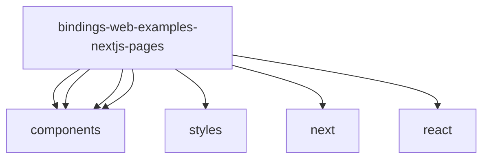

# Imports

[← Back to MODULE](MODULE.md) | [← Back to INDEX](../../INDEX.md)

## Dependency Graph

## External Dependencies

Dependencies from other modules:

- `@/components/DependentFields`
- `@/components/FormValidator`
- `@/components/InsuranceForm`
- `@/components/WorkerExample`
- `@/styles/globals.css`
- `next/head`
- `react`

