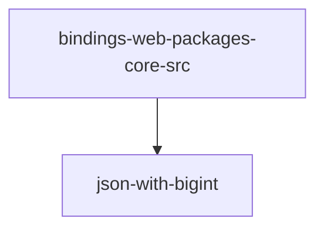

# Module: bindings/web/packages/core/src

[← Back to INDEX](../../INDEX.md)

**Type:** js/ts | **Files:** 1

**Entry point:** `bindings/web/packages/core/src/index.ts`

## Files

| File | Lines | Large |
| ---- | ----- | ----- |
| `bindings/web/packages/core/src/index.ts` | 1247 | 📊 |

## Documentation

- [outline.md](outline.md) - Symbol maps for large files

---

| High 🔴 | Medium 🟡 | Low 🟢 |
| 0 | 0 | 2 |

## 🟢 Low Priority

### `NOTE` (bindings/web/packages/core/src/index.ts:862)

> schema is not updated as we don't have access to it from the cache key

### `NOTE` (bindings/web/packages/core/src/index.ts:957)

> You must call .free() on the returned object when done.
---

## External Dependencies

Dependencies from other modules:

- `json-with-bigint`
