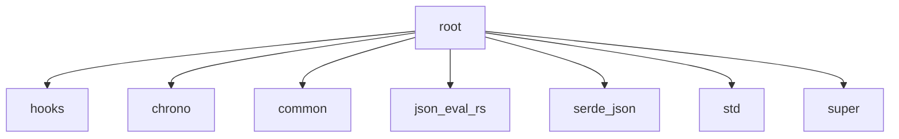

# Imports

[← Back to MODULE](MODULE.md) | [← Back to INDEX](../../INDEX.md)

## Dependency Graph

## Internal Dependencies

Dependencies within this module:

- `react`

## External Dependencies

Dependencies from other modules:

- `@/hooks/useJSONEvalWorker`
- `chrono`
- `common`
- `json_eval_rs`
- `serde_json`
- `std`
- `super`

