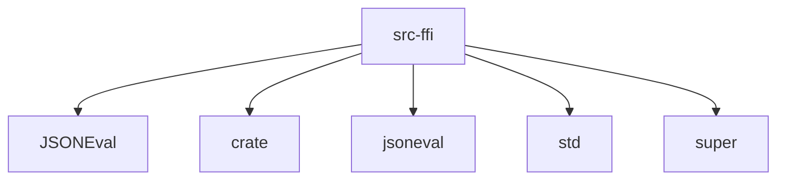

# Imports

[← Back to MODULE](MODULE.md) | [← Back to INDEX](../../INDEX.md)

## Dependency Graph

## Internal Dependencies

Dependencies within this module:

- `compiled_logic`
- `core`
- `evaluation`
- `layout`
- `parsed_cache`
- `schema`
- `subforms`
- `types`

## External Dependencies

Dependencies from other modules:

- `JSONEval`
- `crate`
- `jsoneval`
- `std`
- `super`

