# Imports

[← Back to MODULE](MODULE.md) | [← Back to INDEX](../../INDEX.md)

## Dependency Graph

```mermaid
graph TD
    src_jsoneval[src-jsoneval] --> EvalData[EvalData]
    src_jsoneval[src-jsoneval] --> JSONEval[JSONEval]
    src_jsoneval[src-jsoneval] --> LogicId[LogicId]
    src_jsoneval[src-jsoneval] --> ParsedSchema[ParsedSchema]
    src_jsoneval[src-jsoneval] --> ReturnFormat[ReturnFormat]
    src_jsoneval[src-jsoneval] --> crate[crate]
    src_jsoneval[src-jsoneval] --> indexmap[indexmap]
    src_jsoneval[src-jsoneval] --> once_cell[once_cell]
    src_jsoneval[src-jsoneval] --> parse_schema[parse_schema]
    src_jsoneval[src-jsoneval] --> rlogic[rlogic]
    src_jsoneval[src-jsoneval] --> serde[serde]
    src_jsoneval[src-jsoneval] --> serde_json[serde_json]
    src_jsoneval[src-jsoneval] --> std[std]
    src_jsoneval[src-jsoneval] --> super[super]
    src_jsoneval[src-jsoneval] --> time_block[time_block]
```

## Internal Dependencies

Dependencies within this module:

- `cancellation`
- `core`
- `dependents`
- `eval_cache`
- `eval_data`
- `evaluate`
- `getters`
- `json_parser`
- `jsoneval`
- `layout`
- `logic`
- `parsed_schema`
- `parsed_schema_cache`
- `path_utils`
- `static_arrays`
- `subform_methods`
- `table_evaluate`
- `table_metadata`
- `types`
- `utils`
- `validation`

## External Dependencies

Dependencies from other modules:

- `EvalData`
- `JSONEval`
- `LogicId`
- `ParsedSchema`
- `ReturnFormat`
- `crate`
- `indexmap`
- `once_cell`
- `parse_schema`
- `rlogic`
- `serde`
- `serde_json`
- `std`
- `super`
- `time_block`

