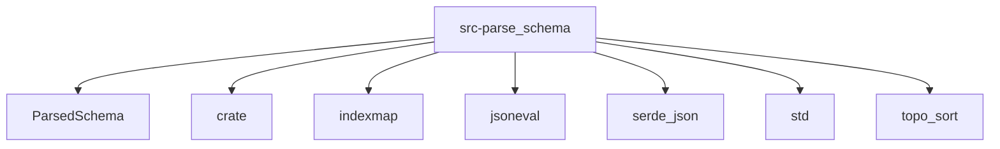

# Imports

[← Back to MODULE](MODULE.md) | [← Back to INDEX](../../INDEX.md)

## Dependency Graph

## Internal Dependencies

Dependencies within this module:

- `common`
- `legacy`
- `parsed`

## External Dependencies

Dependencies from other modules:

- `ParsedSchema`
- `crate`
- `indexmap`
- `jsoneval`
- `serde_json`
- `std`
- `topo_sort`

