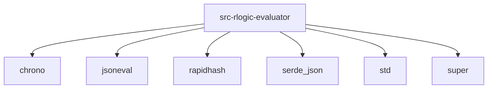

# Imports

[← Back to MODULE](MODULE.md) | [← Back to INDEX](../../INDEX.md)

## Dependency Graph

## Internal Dependencies

Dependencies within this module:

- `arithmetic`
- `array_lookup`
- `array_ops`
- `comparison`
- `date_ops`
- `helpers`
- `index`
- `logical`
- `math_ops`
- `optimizations`
- `rlogic`
- `string_ops`
- `types`

## External Dependencies

Dependencies from other modules:

- `chrono`
- `jsoneval`
- `rapidhash`
- `serde_json`
- `std`
- `super`

