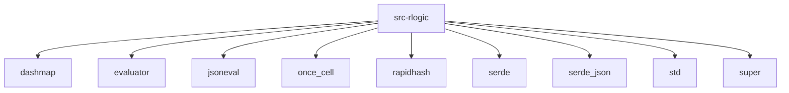

# Imports

[← Back to MODULE](MODULE.md) | [← Back to INDEX](../../INDEX.md)

## Dependency Graph

## Internal Dependencies

Dependencies within this module:

- `compiled`
- `compiled_logic_store`
- `config`

## External Dependencies

Dependencies from other modules:

- `dashmap`
- `evaluator`
- `jsoneval`
- `once_cell`
- `rapidhash`
- `serde`
- `serde_json`
- `std`
- `super`

