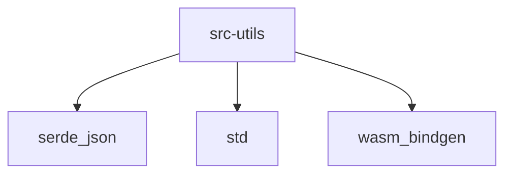

# Module: src/utils

[← Back to INDEX](../../INDEX.md)

**Type:** rust | **Files:** 1

**Entry point:** `src/utils/mod.rs`

## Files

| File | Lines | Large |
| ---- | ----- | ----- |
| `src/utils/mod.rs` | 175 |  |

---

## External Dependencies

Dependencies from other modules:

- `serde_json`
- `std`
- `wasm_bindgen`
