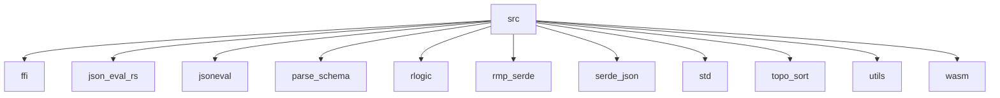

# Imports

[← Back to MODULE](MODULE.md) | [← Back to INDEX](../../INDEX.md)

## Dependency Graph

## External Dependencies

Dependencies from other modules:

- `ffi`
- `json_eval_rs`
- `jsoneval`
- `parse_schema`
- `rlogic`
- `rmp_serde`
- `serde_json`
- `std`
- `topo_sort`
- `utils`
- `wasm`

