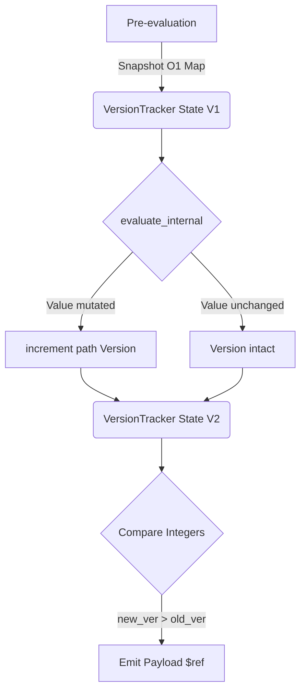

# JSON Evaluation Cache Architecture

This document describes the caching and latency optimization systems built into the JSON Evaluation Engine (`jsoneval-rs`). The architecture achieves massive performance gains (sub-second UI updates across massive schemas >5MB) by aggressively mitigating JSON pointer traversals, eliminating deep copy clones, and maintaining real-time incremental variable graphing.

## Core Concepts

The evaluation engine leverages three major overlapping optimization pipelines:
1. **Zero-Clone Memory Tracking (`VersionTracker`)**
2. **Subform Data Isolation and Tiered Swapping (`SubformItemCache`)**
3. **`$static_array` Extraction and `O(1)` Native Deserialization**

---

### 1. Zero-Clone Memory Tracking

When `evaluate_dependents` analyzes cascading rule changes (`onChange` payloads etc.), we must find which `$evaluation` paths naturally triggered state modifications across the full execution schema.

The legacy approach performed massive snapshot cloning: parsing the entire `EvaluatedSchema`, executing the engine recursively, and then looping over every JSON object checking `new_val != old_val`. This created exponential memory thrashing on large forms (e.g. 300+ tracked variables = 300 JSON clones).

#### `VersionTracker`

Instead of deep-copying JSON objects to perform state comparison, the engine introduces a discrete tracking hashmap powered by unsigned integers: `IndexMap<String, u64>`. 



By querying the mapped path string (e.g., `"/properties/insured/name"`), the engine tracks state completely autonomously. This drops UI-update dependencies evaluations linearly from ~800ms down to tightly bound CPU times of ~400ms.

---

### 2. Tiered Subform Iteration

Evaluating arrays holding deeply nested complex schema rules (`$subforms`) historically multiplied total evaluation latency tightly by item-count $O(L \times N)$ because it inherently cloned the global `5MB+` engine context iteratively for each row.

We introduced **Subform Indexed Isolation** via two powerful abstractions:
1. **Lightweight Synthetic Context:** Rather than deep cloning the `eval_data.data()`, we construct an ephemeral context consisting of scalar variables natively stripped of immense unused array references.
2. **`Tier 2` Subform Caches (`SubformItemCache`):** 

When sweeping through a rider array or table, the engine lends its primary Tier 1 Global Cache to the inner scope sequentially. 

> [!TIP]
> If a subform item hasn't explicitly been mutated, and its global dependencies haven't bumped their `VersionTracker` signatures, the framework perfectly resolves its complex formula block instantly from cache in `O(1)`.

If processing encounters a changed rider `[2]`, the system safely swaps the mutated elements dynamically out of `active_item`, diffs exactly the indices, and preserves unmutated riders `[0], [1], [3]` securely locked inside global cache memory.

---

### 3. Native `$static_array` Extraction

Storing enormous multi-thousand row dynamic tables inside parsed JSON schemas drastically restricts evaluation latency strictly due to the `JSON Pointer` recursion requirement inside typical engine parsers. 

The evaluation framework abstracts huge static arrays entirely during initial parsing using the `$static_array` extraction pass mapping real logic into `IndexMap<String, Arc<Value>>`.

#### Extraction Process
When parsing `JSONEval::new()`, data matrices (`arr.len() > 10`) like `ZLOC` and `PREMIUM_RATES` are forcefully removed and replaced with lightweight abstraction tags:
```json
// Example Parsed Schema Tag
{
   "PREMIUM_RATES": { "$static_array": "/$params/references/PREMIUM_RATES" }
}
```

> [!IMPORTANT]
> Because standard serialization drops references directly back to strings, previously the framework would iteratively scan all $~500,000$ returned nodes trying to regex search the tag string internally.

**O(1) Direct Deserialization**

In `getters.rs`, reconstructing the final output `get_evaluated_schema(skip_layout)` relies strictly on iterating the locally verified tracking index map key values: 
```rust
for (static_key, array_arc) in self.static_arrays.iter() {
    if let Some(target_val) = schema_output.pointer_mut(schema_path) {
        // Automatically patches the array block natively using pointer muts.
         *target_val = (**array_arc).clone();
    }
}
```
This forces all massive array reinstatements exactly onto the object root `O(T) directly` instead of doing heavy `O(Nodes)` regex traversals. 

---

### Summary Checklist for Extending
- [x] **New Features**: When developing `engine.run()` interactions, ensure you utilize `self.eval_cache.bump_data_version(path)` safely if variables are directly overriden beyond tracking logic.
- [x] **$params vs $table Arrays**: Both root mapping paths perfectly hook the `$static_array` tracking API efficiently mapping directly out of `schema_str`.
- [x] **Subform APIs**: You can trigger targeted single row logic directly scaling pointer notation (e.g. `['riders'][1]`) using `resolve_subform_path(idx)`.
